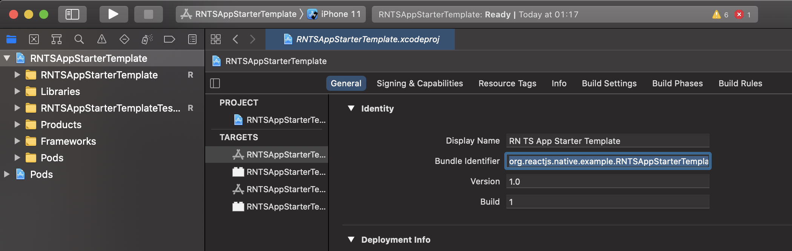
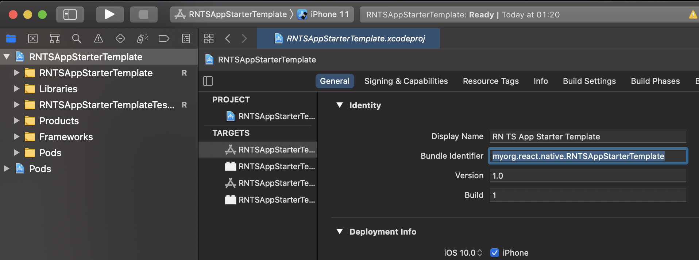

## Architecting and Designing a React Native Application

## React Native with Typescript App Starter Template  

### (with React Native v0.63)

### 1.0 What this article is about 

This writeup is a primer on getting started with building React Native (RN) applications, while presenting a startup template I have created, that you can use as a foundation to build your next RN application, or borrow from the design and architecture pattern in the template, to implement in your RN application. Find the template here on my [GitHub account](https://github.com/Kaybarax/react-native-with-typescript-app-starter-template).  

In this article, through the template, I will guide you through the parts of a RN application, while through the template’s architecture and design, guide you on some best practices, that I employ, on how to architect a RN application. 

A little preface about me, and my experience with RN. As of this time of writing this article, October 2020, I have close to 4yrs experience in developing RN applications. I started developing RN applications in 2017, for the first company that I was employed.  

Okay, let’s get to it. 

### 2.0 Environment setup for RN development 

Before you can develop RN applications, you need to have your environment ready. RN’s official documentation site, https://reactnative.dev, covers this in depth, and so to avoid reiteration, I will only touch on the fundamentals here. 

For my dev environment, the following are the artifacts in my toolbox/machine.  

- Java – check out Digital Ocean for installation directions. 

- Android studio and SDK (and do the configurations, e.g. setup ANDROID_HOME for your machine), for any needed android native stuff.  
 
- Cocoapods in Mac, for installing RN iOS cocoa dependencies. To install cocoapods through Homebrew, from terminal, run `$ brew install cocoapods`. 

- XCode for iOS configurations, any needed iOS native stuff, and eventually deployment to AppStore when the app is ready for release. 

- Nodejs & npm – check out Digital Ocean for installation directions. 

- Nodejs’ npx; from terminal run `$ sudo npm i -g npx` to install it.  

- Yarn package manager (my preferred node packages manager 👍). Official installation instructions from their site https://classic.yarnpkg.com/en/docs/install.  

- An android emulator which you can create from Android Studio, or Genymotion emulator, which is an alternative that I would highly recommend. Or, just as well, an android device.  

- iOS simulator which comes with XCode. Or just as well, an iOS device. 

### 3.0 Starting RN application development 

Now that the environment is all setup, you can now start developing RN applications. 

To get started with your first RN application:  

- Open your development directory in terminal. 

- Run `$ npx react-native init yourAppName --template react-native-template-typescript` (I am not using the popular Expo here. If you have heard of Expo and you would like to use it, you can check it out from their site). And that command will create your RN application. 

* For android: 

* * Start up your emulator or connect your android device. 

* * Run `$ yarn start`

* * Run `$ npx react-native run-android`, and wait for the application to install into the emulator or device. After installation, the installed app will try to pull the JavaScript(js)/Typescript(ts) UI code, to display the UI. 

* * To push UI code updates to the emulator, or connected device, with Android Debug Bridge (adb), run `$ adb reverse tcp:8081 tcp:8081`, and then:  

* * * If using an emulator, on the keyboard, double tap R, to reload/push the UI code to the app in the emulator. 

* * * If using a physical device, give the device a shake, so that the RN development context-menu pops up on the screen. From the context-menu, tap “Reload” to reload/push the UI code to the app in the device.  

* * To push UI code updates to the emulator or physical device over a WIFI/network: 

* * * If using an emulator, if from a Personal Computer (PC), press Ctrl+M or ⌘+M from a Mac to bring up the RN development context-menu, then select “Settings”, then select “Debug server host & port for device”, and then, if Genymotion emulator, enter 10.0.3.2:8081; if Android emulator, enter 10.0.2.2:8081, and then click “Ok” to set it. Exit back to the app, and then double tap R from the keyboard to reload/push the UI code to the app. 

* * * If using a physical device, make sure your device and PC/Mac are both connected to the same network. Shake the device to raise the RN development context-menu, then select “Settings”, then “Debug server host & port for device”, and then enter your PC/Mac’s <IP address>:8081 and click “Ok” to set it. Exit back to the app, and then shake the device again, and from RN development context-menu, tap “Reload” to reload/push the UI code to the app. 

* For iOS, firstly to state it, it’s best to run it from XCode, so that you can also make any configurations, such as “Schemes” and “PList” configurations, and, as well select an iOS simulator. As thus: 

* * Install iOS cocoa dependencies; in preferably a new terminal window, under the project root directory, run `$ cd ios/ && pod install`. This will create the <your-project-name.xcworkspace file> under the <ios directory>, and it is that file that later you will open in XCode. Please make sure to add the generated files to your git. 

* * Open the project in XCode and make any configuration as you fancy.  

* * Make sure you have run `$ yarn start`. 

* * Click the “run” button from XCode. This will start up the simulator, and install the app into the simulator, or install the app into a selected device, if you have connected one and selected it in the Scheme, for development. Note that for the app to be installed into a connected device for development, you must have signed into XCode with your/your team’s Apple Developer account. Then from the project’s “Build Settings” in XCode, under “Signing” make sure you have selected and set that “development account.” 

* * Once the app is fully installed and running, to push future UI development updates to the app, if it does not do so automatically when you save your updates from your development IDE, to do so:  

* * If using a simulator, with the simulator in focus, press ⌘+R from the keyboard. 

* * If using a physical device, just like the case with android, shake the device, and follow similar steps as described upper above, in the case for android. 

Note, that in both cases of android or iOS, and their emulators/simulators, or devices for development, if you have activated the browser debugger and running it on http://localhost:8081/debugger-ui/ in the browser; from the browser you can invoke reloading by clicking the “Reload App” button which will also push the latest, saved, UI code to the app, on reload. 
 
And happy development 🙂  

### 4.0 Skipping some parts of part 3.0 above, and using the template I have created “React Native with Typescript App Starter Template” to develop your application  

You can: 

##### *From github, create your project, based off this template, by creating your RN app repo using this template*    
 
1. After the creation of the repo, clone your repo to your local development directory. 

2. Run `$ yarn install` to install node dependencies. 

3. Install iOS cocoa dependencies; in preferably a new terminal window, under the project root directory, run `$ cd ios/ && pod install`. If not there, this will create the <your-project-name.xcworkspace file> under the <ios directory>.  

4. In <package.json file> rename project name to your app’s project name. As well, remove any of my, unnecessary, details. 

5. If you do not have it, install this npm package globally, i.e. Run `$ npm install react-native-rename –g`. You will use it to rename the application. 

6. Be safe with your project, so checkout a new branch to perform the app renaming; run `$ git checkout -b rename-app`.  

7. Rename application; run `$ react-native-rename "your-app-name e.g. My App" -b "your-app-bundle e.g. com.myorg.myapp"`. This will rename to your app details in <app.json file> and in <android directory>. However, it will not update the app bundle name for iOS, so you will have to do that from XCode as detailed below. 

 7.1 Start XCode, and from it open the <your-project-name.xcworkspace file> that was generated upper above. 

 7.2 Rename the app bundle to your appropriate app bundle name, e.g. as displayed from the first figure to the next figure, in the figures below. 

7.3 Exit XCode. 

7.4 Delete node modules, i.e. from the terminal in the project’s root directory run `$ rm -rf node_modules`. Then delete also the iOS cocoa pods, i.e. from <ios directory> run `$ rm –rf Podfile.lock`, then `$ rm –rf Pods`.  

7.5 Reinstall node modules. Then reinstall iOS cocoa pods. And you can now open XCode and run the RN iOS app in your iOS simulator or physical device. 

And all is good to go. Your application is ready and good to go, based on this template 👍👍👍  

 
##### *Use this template to guide you in architecting and designing your RN app, that you are already in the process of developing*

If you have already been developing your application, you can just go through the code and look at the architecture and design employed in this template, for some extra guidance as you continue to develop your RN application.    

### 5.0 A Walk through “React Native with Typescript App Starter Template” architecture and design  

At the root directory, I would like to discuss the directory, <app directory>. I always create an “app” directory where I contain and organize 99% of the bulk of my development code. This way, should the android, or iOS native parts crash beyond recovery, or into tedium recovery, I can always start a new RN app, and copy over this “app” directory which, essentially, has everything.  

##### < app directory> contents 

The following are the contents of this directory. 

###### <App.tsx file>  

This is the point that connects the whole js/ts, application UI code/logic in this directory to the outside “index.js” where the app is bootstrapped. 

This is also where the application’s global state (stores) with MobX state manager (further discussion on MobX later) is loaded into the application. 

###### <app-entry.tsx file> 

This is where the app with all its “composed routes” (more explanation on this, later under routing and navigation (R&N) discussion) is loaded and exported to <App.tsx file>. Because it deals with loading the app with its “composed routes,” which in this app, is being handled by React Navigation (RNvg); it is in this file, where “react-native-gesture-handler” is loaded as the very first “import”, as required by RNvg. 

###### <safe-component-wrapper.tsx file>  

This is my error boundary component file for catching React run-time errors. I use it also in my React web applications. 

###### <fallback-page.tsx file>  

When <safe-component-wrapper.tsx file> catches a React component run-time error, this is the component that is rendered, and reports that there has been a problem. This and the former component, work well together for graceful app failure and error reporting, when that incidence occurs. 

###### <app-config.tsx file>  

This is just a file I created where I can declare some global constants that I am working with.  

###### <views directory> 

This contains the components that render an interaction point/screen (view) to the user. A view works in conjunction with its MobX global state/store, and other MobX global states/stores that it may subscribe to, a controller with functions that the view uses to perform its logic, its child sub-views, and associated routing and navigations.  

###### <controllers directory> 

The files with the controller functions for the views; they perform such as API calls, to state/store updates. 

###### <media directory> 

Store here static images, videos, gifs, etc. 

###### <theme directory> 

Application theme, and styling files that will be used by the view components and their sub-views. As well, global themes and styling for any modules you have. 

###### <shared-components-and-modules directory> 

Items that are shared across the application, for example: 

- Notifications <notification-center directory> 

- Form controls <form-controls directory> like: 

* * Text inputs. 

* * Select (spinners/pickers). 

* * Radio buttons and check boxes. 

* * Etc. 

- Camera photo/video capture module <camera-photo-capture-module directory> 

- Task progress loaders. 

- Etc. 

###### < stores directory> 

The application's global state (stores). I used MobX here in this template, but you can replace it with any other React global state manager such as Redux, Zustand etc. To learn more about MoBX, see official documentation, https://mobx-state-tree.js.org/intro. 

I declare the stores through schemas in </stores/ store-schemas.js file>, then I make them ready for provisioning through the object, StoreProviders, in </stores/ store-providers.js file>. Then they are instantiated in the function loadAppStores() in </stores/ app-stores.js file>. I like this approach of creating MobX stores from schemas, because:  

a). The schemas are useful in defining a store’s structure.  

b). It gives me a reference point to reset a store’s data when I need to. 

The main view activities that will render the main screens/views, each have a store assigned to them. MobX marks those stores (a MobX store is just JavaScript object) as observable so that any changes that happens to them will result to a view that has been subscribed to that/those store(s), to be re-rendered and get updated. Here is sample code from function loadAppstores(), showing how I create my, MobX, observable, stores.
 

    ...
    try { 
 
    this.stores = {}; 
    this.appStoresLoaded = false; 
 
      for (let key in StoreProviders) { 
        let storeKey = StoreProviders[key].storeKey(AppStores.namespace); 
        let storeProvider = StoreProviders[key]; 
        let store = await persistedStoreFromAsyncStorage(storeKey, storeProvider, AppStores.namespace); 
        isNullUndefined(store) && (store = storeProvider.storeProvidedBy(AppStores.namespace)); 
        this.stores[key] = observable(store); 
        console.log('CREATED STORE -> ', key, ' -> ', toJS(this.stores[key])); 
      } 
     
      this.appStoresLoaded = true; 
      ...

The function above, when called, gets, and creates store objects from StoreProviders and wraps the created stores in an observable high order component (HOC) from MoBX. Notice that I attempt to first find a store first, from AsyncStorage before creating it. This is because I have provided functionality for persisting stores to AsyncStorage. This is useful, for such as offline storage of data, and also persisting data during app development to save time, from such as re-entering huge form data, especially, across reloads. To persist store data, just call a store persistence function from </stores/store-utils.js file> in a view component, that needs to persist that/those stores. Here is sample code from <app/views/recipe-box-sub-app-views/login.tsx file>, showing persistence of loginStore, so that on subsequent app restarts, a user does not have to re-enter their username. 

    ...
    //persist login store 
    persistStoreToAsyncStorage(loginStore).then(null);   
    ...
 

*** Notice that I do not hold the user’s password in the loginStore. This is to avoid any potential security incident. Do not persist sensitive user credentials, if it might cause a security incident. ***  

In </stores/with-stores-hoc.tsx file> I have a HOC which I use to pair observable stores with an observer view component. It is not only the main views that can be “observers.” Sometimes you might need a child-view(s) composed inside a parent view, to be subscribed to store(s), for some needed data, and you do not want to do prop-drilling of that/those store(s) to the child-view component(s). In that case you can use the same HOC from above to inject the store(s) to the child view component(s). See this sample code from <app/views/recipe-box-sub-app-views/home.tsx file>, for example:      
    
    ...
    //inject needed appStore and recipeBoxStore 
    let RecipeListItemCardWithStores = WithStoresHoc(RecipeListItemCard, ['recipeBoxStore', 'appStore']); 
    ...
    
Besides </stores/ app-stores.js file>, there can be any other number of “<...-store.js/ts files>” if you want to use them to separate instantiations of different stores or groupings of stores, e.g. for sub-applications in your application. 

###### <routing-and-navigation directory> 

The application’s routing and navigation logic is stored here. Like I had mentioned earlier, I have used the popular React Navigation (RNvg) library, for this functionality. In this template, I have tried to use as much of the functionalities availed by the RNvg, to show you as much as possible, the various R&N facilities availed by RNvg. For your in-depth knowledge and information on RNvg, see RNvg official documentation https://reactnavigation.org/.  

You can see all these various functionalities of RNvg, here in <app/routing-and-navigation/routing-composition.tsx file>. 

 
- Drawer navigation – Used as the main/base R&N that the app’s main views sit upon.  

- Stack navigation - Used this for the first child of the above drawer navigation. That child comprises several different views, that are put together with stack navigation. The main R&N for the recipe-box sub-application also uses this navigation functionality. 

- Top tabs navigation - Used in the landing screen/view of the main app.  

- Bottom tabs navigation - Used in the landing screen/view of recipe-box sub-application.  

In this directory the other important/main files are: 

- <views-routes-declarations.tsx file> - Here, I import all the views, and as well their groupings, that will need to be registered as routes (view routes) with RNvg, so that they be navigated to. The registration happens in <routing-composition.tsx file>, where a route is made known to RNvg routing functionalities.  

- <app-navigation.ts file> - Has the class that defines the functionalities for controlled navigation in the app using ANY (R&N agnostic) library you might want to use. Once again, ANY, not just RNvg; so, whatever R&N library you fancy, you can pair it with the navigation functionalities in this class for a controlled navigation in your app. 

- <routing-and-navigation-utils.tsx file> - R&N utility functions and stuff. 

The afore discussed, are the main and important files in R&N directory. The other files in that directory, come in to serve their R&N functionalities as needed. 

###### <android-custom-native-modules directory>  

In RN, when you want to handle some stuff with custom native code (java/kotlin/objective-c), RN facilitates this through custom native modules. You write the native functionality in native code (custom native modules), and then you import your native functionality across the RN bridge to the ts/js side, for its use. To demonstrate this, in tis template, I created a java module for hashing a user password on sign-up for the recipe-box sub-application. And as well, validating that password on login.  

An android custom native module on the android native side of RN consists of 2 parts: 

- A module class, <android/app/src/main/java/app_custom_native_modules/ AppSecurityModule.java file>, for example. 

- A module packager class, <android/app/src/main/java/app_custom_native_modules/ AppSecurityPackage.java file>, for example. 

The methods in the module class for, both hashing and validating the password, that will be called from the js/ts side, MUST be annotated with @ReactMethod. See sample code below.  

In <android/app/src/main/java/app_custom_native_modules/AppSecurityModule.java file>. 

    ...
    @ReactMethod 
    public void createPasswordHash(String passwordText, Callback callback) { 
     
        this.passwordText = passwordText; 
        this.callback = callback; 
        this.currentActivity = getCurrentActivity(); 
     
        if (this.currentActivity == null) { 
            this.callback.invoke(NULL_CURRENT_ACTIVITY); 
            return; 
        } 
    ...
    
And
    
    ... 
    @ReactMethod 
    public void validatePasswordWithHashAndSalt(String passwordToValidate, String hash, String salt, Callback callback) { 
     
        this.passwordToValidate = passwordToValidate; 
        this.userHash = hash; 
        this.userSalt = salt; 
        this.callback = callback; 
        this.currentActivity = getCurrentActivity(); 
     
        if (this.currentActivity == null) { 
            this.callback.invoke(NULL_CURRENT_ACTIVITY); 
            return; 
        } 
    ...

The module packager class, then gets an instance of the module class and exports it to <../MainApplication.java file> so that the module can be availed for import on the js/ts side. 

In <android/app/src/main/java/app_custom_native_modules/AppSecurityPackage.java file>. 

    ...
    @NonNull 
    @Override 
    public List<NativeModule> createNativeModules(@NonNull ReactApplicationContext reactContext) { 
        List<NativeModule> modules = new ArrayList<>(); 
        modules.add(new AppSecurityModule(reactContext)); 
        return modules; 
    } 
    ...

And in <../MainApplication.java file> 

    ...
    @Override 
    protected List<ReactPackage> getPackages() { 
      @SuppressWarnings("UnnecessaryLocalVariable") 
      List<ReactPackage> packages = new PackageList(this).getPackages(); 
      // Packages that cannot be autolinked yet can be added manually here, for example: 
      // packages.add(new MyReactNativePackage()); 
        packages.add(new AppSecurityPackage()); 
        packages.add(new AppIntentsPackage()); 
      return packages; 
    } 
    ...

On the js/ts side, in <app/android-custom-native-modules/custom-native-modules.js file> the java custom native modules are imported. Then the modules’ functions are consumed in <app/android-custom-native-modules/app-security-custom-native-module.js file> 

When a js/ts function makes a call to custom native module, the function call is asynchronous. So, it needs a promise, or a callback function for feedback. I am using a callback in this case. The native module, can return a result through the callback/promise functionality and/or as well emitting the result through an event emitter, in which case the result is listened for on the js/ts side, by an event listener. See sample code below. 

Result feedback through a callback from <android/app/src/main/java/app_custom_native_modules/AppSecurityModule.java file>  

    ...
    String hash = createHash(this.passwordText); 
     
    this.responseMap = Arguments.createMap(); 
     
    //feedback data 
    this.responseMap.putString("message", SUCCESS_CALLBACK); 
    this.responseMap.putString("passwordHash", passwordHash); 
    this.responseMap.putString("passwordSalt", Arrays.toString(passwordSalt)); 
     
    //respond 
    this.callback.invoke(this.responseMap); 
    ...

Result feedback through an eventEmitter from <android/app/src/main/java/app_custom_native_modules/Util.java file> 

    ...
    public static void emitPasswordValidationResult(ReactContext reactContext, WritableMap params) { 
        reactContext.getJSModule(DeviceEventManagerModule.RCTDeviceEventEmitter.class).emit("password_validation_result", params); 
    } 
    ...
 

When the js/ts function call’s result is to be received through a callback, you need to just make the function call, and pass a callback function to return the result. If the result will be returned from listening to a DeviceEventEmitter, then before making in the js/ts function call, you first initialize an event listener for that event’s name, and then pass to it an event listener function, that will listen for the result feedback for that “event name.” 

###### < util directory>  

Utility functionalities for the application. 

- <app/util/util.js file> - Just JavaScript utility functions. 

- <app/util/network-calls-util.ts file> - Network calls utility.  

- <app/util/react-native-based-utils.js file> - JavaScript utility functions that solely fit within the the RN environment.  

- <app/util/react-native-data-collection-utils.js file> - Used by Form-controls on data collection. 

 

##### Extras/Miscellaneous: 

###### < app-dev-scratch-pad directory> 
I just added this for mocking and testing out stuff. 

###### < app-management directory> 
This is not really needed. I just added it, to put in it, stuff that I have been using during the template development. This is stuff such as data that I should have been receiving from a server. 

###### < auth-and-security directory> 
Not really needed, but you can place in here anything that you would like to do with your app’s security and/or authentication. 

### 6.0 Finally releasing an RN app to production  

Before an RN app can be published to production, to Google PlayStore or Apple AppStore, it needs to be signed. 

- Android release: 

* * Have a paid Google PlayStore account. 

* * Generate a signing key, as very well guided from official RN documentation. 

* * As directed from RN documentation, fill out the details in <android/gradle.properties file> and <android/app/build.gradle file>. For this template, I have already filled out the details in both files, so, if using this template, just overwrite the credentials in <android/gradle.properties file> with your own. 

* * Place the generated signing keystore under the directory <android/app/ directory>. I have provided a keystore there, which you can use to test building a release android apk when using this template. Replace with your key if using this template, for your publication into production.  

To test building the production apk when using this template, from <android directory>, run `$ ./gradlew installRelease` to install and test the release apk in your device. To prepare the release apk to upload to Google Playstore, from <android directory> run `$ ./gradlew assembleRelease`. 

Note that on subsequent updates of your app to Google PlayStore, after the first publication, you must increment the “versionCode” number in the file <android/app/build.gradle file>. 

- iOS release: 

* * Have a paid Apple AppStore account. 

* * Start the process of signing your app and distribution for testing, and finally deployment to the Apple AppStore. It is a lengthy process, so I will leave you with this Medium article  https://medium.com/@the_manifest/how-to-publish-your-app-on-apples-app-store-in-2018-f76f22a5c33a, authored by The Manifest, which I found, that in addition the official Apple documentation, it gives a particularly good and detailed guide on this process. 

   

*!A little note, and disclaimer on “react-native-sqlite-storage" as I wind up!*  

For the recipe-box sub-application in the template, I used “react-native-sqlite-storage” to store users’ sign up data locally in the app, but I would not recommend it. It is rather buggy, on retrieving data you have saved, and it does not come with good handling of such as batch SQL transactions, and you have to write a lot of your own extra code to handle that. If you want use SQL-lite, I recommend using the native one that comes with mobile devices.  

 

And that’s a wrap. Happy hacking, and bringing your RN products to market!  

 
Connect with me: 

[Github - Kaybarax](https://github.com/Kaybarax)

[LinkedIn - Kevin Barasa](https://linkedin.com/in/kaybarax) 

[Twitter - Kaybarax](https://twitter.com/Kaybarax)

